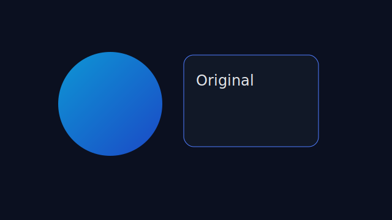
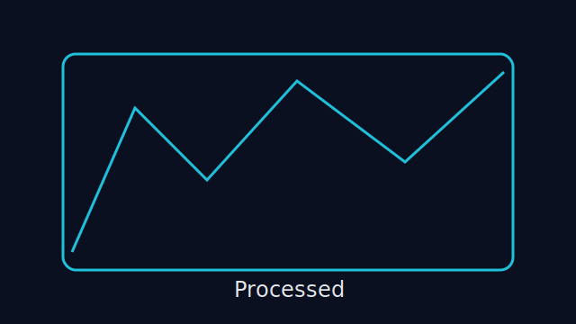

# cvAlgoVis

一个可交互的计算机视觉实验应用：前端实时调参，后端基于 OpenCV 处理图像并返回结果。

## 功能特性

- 三栏工作台：代码区 / 图像区 / 参数区
- 图像区双面板：原始图像 + 处理后图像
- 算法切换：边缘、阈值、形态学、滤波、锐化
- 参数交互：滑块 + 数值输入 + 鼠标滚轮微调
- 实时反馈：前端节流请求后端 `/process`
- 开发辅助：算法 Python 代码片段 + OpenCV 函数说明接口

## 界面截图

### 真实 UI 工作台（本地运行截图）


### 输入示意（原始图像）



### 输出示意（处理后图像）



## 技术栈

- 前端：React + TypeScript + Vite
- 后端：FastAPI + OpenCV + NumPy
- 测试：Pytest（单元 + 集成）

## 目录结构

```text
cvAlgoVis/
  backend/
    app/
      main.py
      catalog.py
      schemas.py
      examples/code_snippets.py
      services/
        algorithms.py
        image_io.py
        opencv_reference.py
        pipeline.py
    tests/
      test_algorithms_unit.py
      test_api_process.py
    requirements.txt
  frontend/
    public/samples/sample-1.svg
    src/
      api/client.ts
      components/*
      hooks/*
      App.tsx
      main.tsx
      styles.css
    package.json
  design/demo/
  docs/api.md
```

## 环境要求

- Node.js 18+
- Python 3.10+
- pip

## 快速开始

### 1) 启动后端

```bash
cd backend
python -m venv .venv
```

Windows:

```bash
.venv\Scripts\activate
```

macOS/Linux:

```bash
source .venv/bin/activate
```

安装依赖并启动：

```bash
pip install -r requirements.txt
uvicorn app.main:app --host 0.0.0.0 --port 8000 --reload
```

后端地址：`http://localhost:8000`

### 2) 启动前端

```bash
cd frontend
npm install
npm run dev
```

前端地址：`http://localhost:5173`

## 测试

在后端虚拟环境中执行：

```bash
cd backend
pytest -q
```

## OpenCV 函数说明

项目在 `backend/app/services/opencv_reference.py` 中系统整理并注释了常见函数：

- `imread`
- `cvtColor`
- `GaussianBlur`
- `Canny`
- `findContours`
- `warpPerspective`
- `matchTemplate`
- `detectMultiScale`

接口查看：

```text
GET /opencv-reference
```

## 常见问题

### `python -m venv .venv` 失败

- 现象：`python: command not found` 或命令直接退出
- 原因：系统未安装可用 Python 或 PATH 未配置
- 建议：先确认 `python --version` 可用，再执行建环境命令

## API 文档

详见 `docs/api.md`

